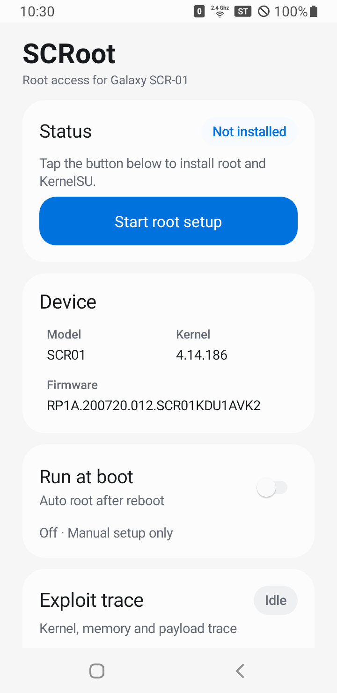
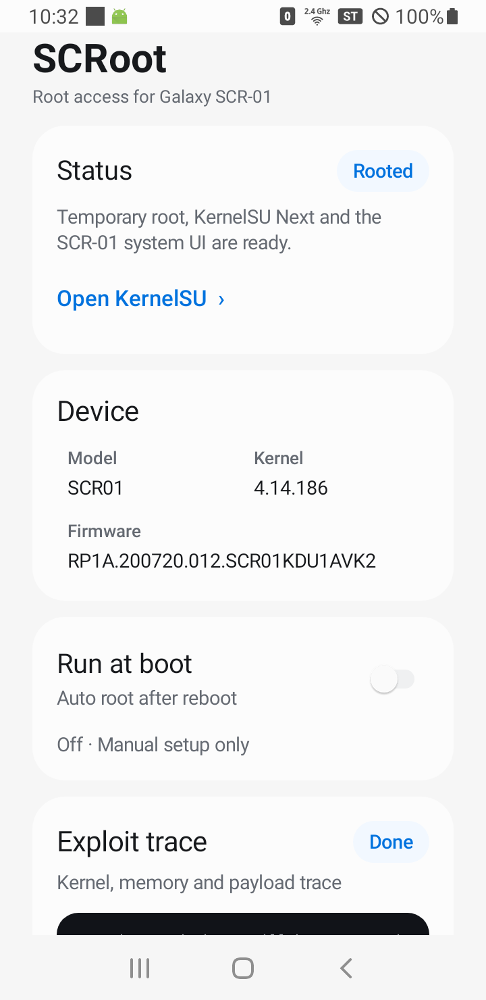
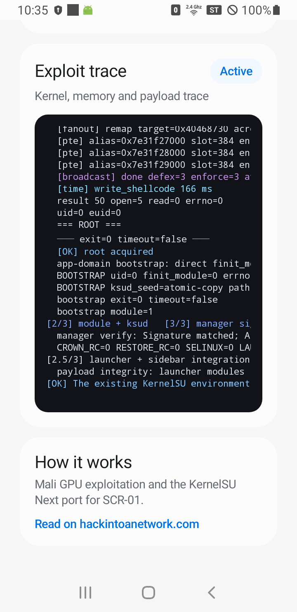
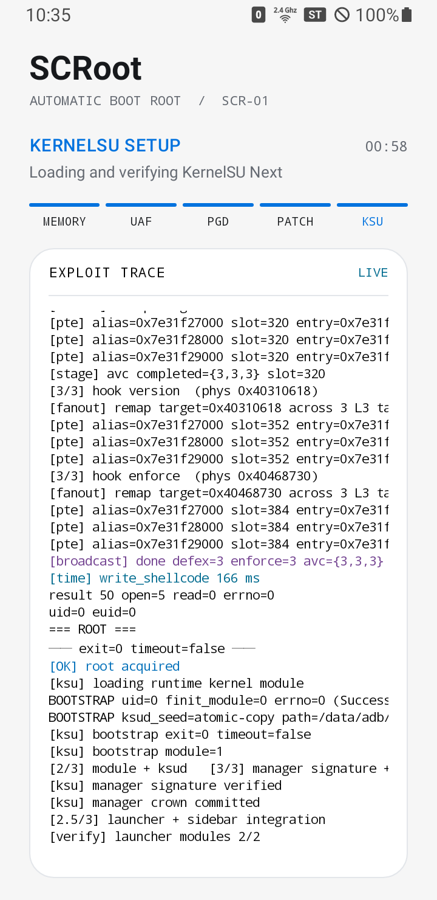
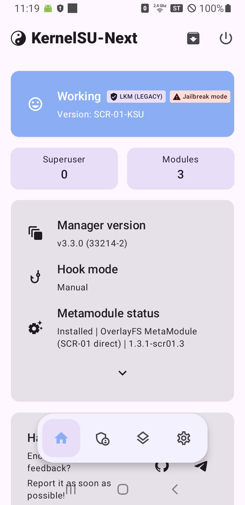

<p align="center">
  
</p>

<h1 align="center">SCRoot</h1>

<p align="center">
  <strong>삼성 SCR-01 모바일 5G 라우터를 위한 원클릭 루팅 및 KernelSU-Next 도구입니다.</strong><br>
  <a href="README.md">English</a> ·
  <a href="README_KO.md">한국어</a>
</p>

<p align="center">
  
  
  
  
  
</p>

SCRoot는 정확히 삼성 SCR-01 모바일 5G 라우터의 `SCR01KDU1AVK2` 펌웨어를 대상으로 하는 원클릭 루팅 앱 입니다. 기기를 검증하고, 내장된 CVE-2022-38181 Mali 익스플로잇을 실행한 다음, `SCR-01`용 KernelSU-Next 포트를 적재하고 매니저와 시스템 UI 통합을 설정합니다.

APK를 한 번 사이드로드한 이후에는 컴퓨터 없이 사용할 수 있습니다.

> [!WARNING]
> 반드시 본인이 소유한 기기에서만 사용하세요. 커널 익스플로잇은 기기를 재부팅하거나 충돌시키고 데이터를 손상시킬 수 있습니다.
>
> 기기 fingerprint, 커널, 펌웨어, payload 또는 매니저 서명이 지원 대상과 일치하지 않으면 SCRoot는 안전하게 실행을 중단합니다.

## 지원 환경

| 항목      | 지원 대상                                |
| ------- | ------------------------------------ |
| 기기      | Samsung SCR-01 / SM-H412J            |
| 제품명     | Galaxy 5G Mobile Wi-Fi               |
| 펌웨어     | `SCR01KDU1AVK2` 정확히 일치하는 지원 프로필 |
| Android | 11                                   |
| 커널      | `4.14.186-24165939`                  |
| SoC     | MediaTek MT6853                      |
| GPU     | Mali-G57, Valhall r25p0              |
| 취약점     | CVE-2022-38181                       |
| 루트 방식   | 부팅마다 사라지는 임시 루트                      |

## 주요 기능

- 화면에 익스플로잇 과정을 표시하는 원클릭 루트 설정
- SCR-01 커널용 KernelSU-Next v3.3.0 포트
- KernelSU 매니저, `ksud`, OverlayFS MetaModule 자동 구성
- 선택 가능한 재부팅 후 자동 루팅
- 순정 SCR-01 사이드 메뉴의 Root 항목
- One UI 스타일 Apps 및 최근 앱 통합
- 앱 인터페이스 라이트·다크 테마를 지원

내장된 Home 및 SystemUI 통합 모듈에는 Samsung의 `MHSHome.apk` 또는 `SystemUI.apk`가 포함되지 않습니다. 라우터에서 정확한 순정 펌웨어 APK 해시를 확인하고 작은 바이너리 델타를 현장에서 적용한 뒤, 생성 결과의 해시까지 일치할때만 보호된 late bind mount를 수행합니다. 지원되지 않거나 불완전한 결과는 실행 중인 UI를 교체하지 않고 거부됩니다.

## 설치

저장소의 [Releases](../../releases/latest)에서 `SCRoot-SCR01-1.0.0.apk`를 내려받고, USB 디버깅이 활성화된 라우터를 연결한 다음 실행하세요.

```bash
adb install "SCRoot-SCR01-1.0.0.apk"
adb shell am start -n com.scr01.scroot/.MainActivity
```

## 사용 방법

1. SCRoot를 열고 **Start root setup**을 선택합니다.
2. 최초 실행 경고를 읽고 **Continue**를 선택합니다.
3. 익스플로잇 Trace가 실행되는 동안 앱을 전면에 유지하고 기기를 조작하지 마세요.
4. 상태가 **Rooted**로 변경될 때까지 기다립니다.
5. **Open KernelSU**를 선택해 루트 권한과 모듈을 관리합니다.

> [!WARNING]
> 한 부팅에서 실패한 익스플로잇을 다시 실행하지 마세요. 재시도하기 전에 라우터를 재부팅해야 합니다.

## 재부팅 후 자동 루팅

SCRoot에서 **Run at boot**를 활성화하세요. 다음 부팅부터 SCRoot가 실시간 Trace를 표시하고, 최소 안전 uptime을 기다린 뒤 한 번의 보호된 루팅 시도를 실행합니다. 카운트다운에는 기기를 조작하지 않고 기다려야 하는 시간이 표시됩니다.

자동 실행에 성공하면 다음 항목이 복구됩니다.

- 루트 권한과 전체 capability
- KernelSU runtime 및 userspace
- OverlayFS MetaModule
- 순정 메뉴의 SCRoot 및 KSU Next 항목
- Apps 및 최근 앱 통합

커널 패치는 임시로만 유지됩니다. **Run at boot**가 꺼져 있으면 재부팅 시 루트가 사라지며, SCRoot를 다시 수동으로 실행해야 합니다.

## 정상적인 KernelSU 상태

설정에 성공하면 KernelSU-Next에 다음 상태가 표시되어야 합니다.

```text
Status: Working
Version: SCR-01-KSU
Mode: LKM (LEGACY)
Metamodule: Installed
```

매니저 UI는 자동으로 열리지 않습니다. SCRoot, Apps 화면 또는 순정 Root 메뉴에서 직접 선택했을 때만 열립니다.

## 동작 원리

익스플로잇은 Mali JIT use-after-free를 stale backing-page alias로 확장하고, 해당 페이지를 GPU page table로 재사용한 뒤 제어된 PTE를 통해 커널 물리 쓰기를 구성합니다. Runtime payload는 Samsung DEFEX를 비활성화하고 대상 SELinux/AVC 경로를 조정하며, 임시 credential hook을 설치한 후 대상 전용 KernelSU 모듈을 적재합니다.

구현은 `SCR01KDU1AVK2`의 정확한 커널 구조와 Mali ABI에 고정되어 있습니다. 범용 Mali 익스플로잇이나 모든 Samsung 기기를 지원하는 루트 도구가 아닙니다.

자세한 내용은 https://hackintoanetwork.com/blog 에서 확인하실 수 있습니다.

## 소스 및 라이선스

SCRoot의 자체 제작 부분은 PolyForm Noncommercial 1.0.0 라이선스로 제공됩니다. 포함된 제3자 구성 요소에는 각각의 라이선스가 그대로 적용됩니다. GPL이 적용되는 KernelSU-Next 및 meta-overlayfs 구성 요소의 정확한 상류 소스 스냅샷, SCR-01 변경 사항, 빌드 입력 및 배포 해시 대응표는 [`corresponding-source`](corresponding-source)에 포함되어 있습니다. 전체 구성 요소 대응표는 [`THIRD_PARTY_NOTICES.md`](THIRD_PARTY_NOTICES.md)를 확인하세요.
